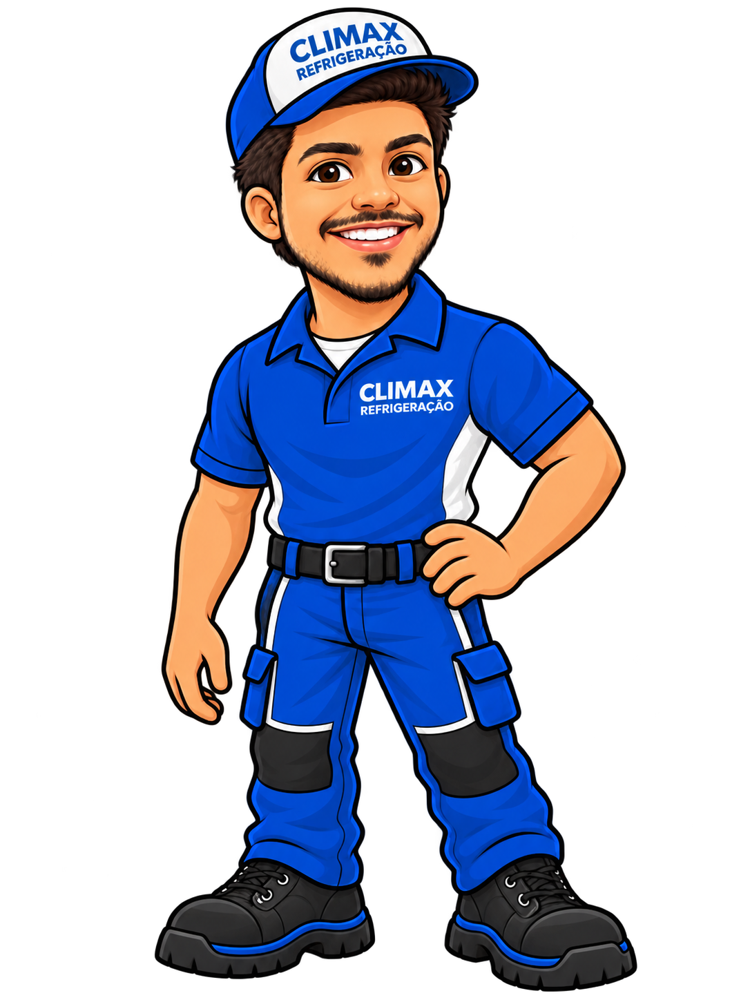
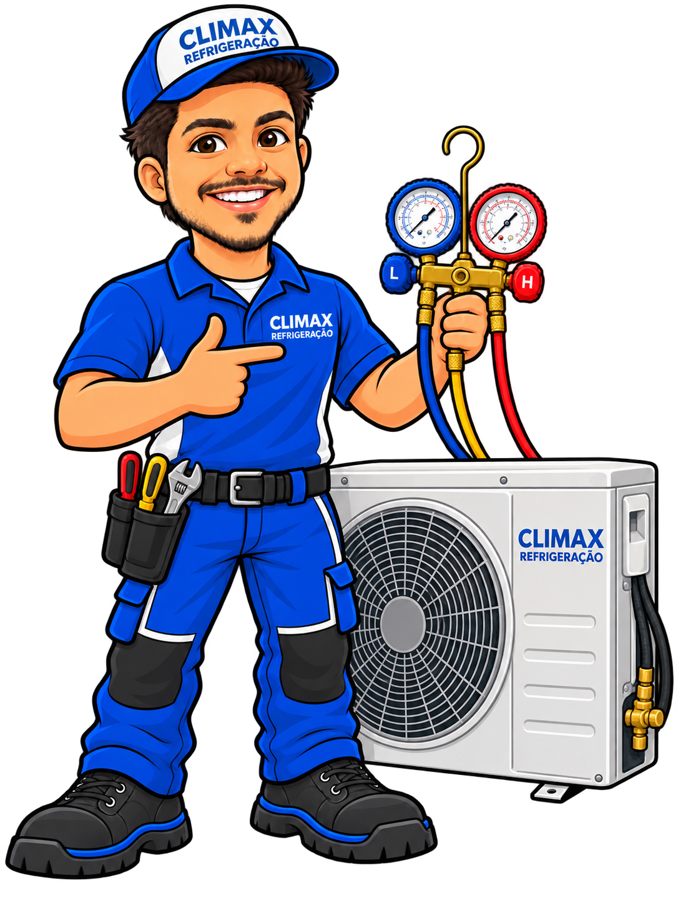

# Identidade Visual — CLIMAX Refrigeração

Repositório oficial de identidade, ativos visuais e sistema de marca da **CLIMAX Refrigeração**.

## Brand Center / Brand Book Mestre

O sistema completo está em [brand-center/](brand-center/).

Ele reúne:

- **Brand Book Mestre** — estratégia, fundamentos, identidade verbal, identidade visual, mascote, aplicações e governança;
- **Biblioteca oficial de assets** — logos, mascotes, tokens e arquivos de produção;
- **Design Tokens** — CSS + JSON com cores, tipografia, spacing, radius, shadows, motion e breakpoints;
- **UI / Digital Design System** — componentes, estados, acessibilidade e padrões digitais;
- **Sistema editorial e conteúdo** — voz, hierarquia, CTAs, formatos, canais, microcopy e QA;
- **Pacote de motion para produção** — source HTML/CSS, manifest, proporções e specs de export;
- **Templates realmente editáveis** — PPTX, Word/RTF, HTML e Markdown.

A entrada web do repositório redireciona para [brand-center/index.html](brand-center/index.html).

## Logos

Os masters estão em [assets/logos/](assets/logos/).

- 4 variações de logo;
- PNG para uso rápido;
- SVG como master vetorial;
- azul master observado nos SVGs: `#0B5BA5`;
- branco master observado nos SVGs: `#F1F2F2`.

## Coleção de mascotes

Os arquivos originais em PNG estão organizados em `assets/mascotes/`.

| Arquivo | Uso sugerido |
| --- | --- |
| `01-mascote-apontando-para-cima-invertido.png` | CTA vertical, destaques e chamadas |
| `02-mascote-principal-corpo-inteiro.png` | Site, banners, carro, panfletos e campanhas |
| `03-mascote-recepcao-mao-estendida.png` | Boas-vindas, atendimento e apresentação |
| `04-mascote-circulo-busto.png` | Instagram, WhatsApp, avatar, assinatura e selo |
| `05-mascote-apontando-cta.png` | Landing page e “Solicite seu orçamento” |
| `06-mascote-com-manifold.png` | Manutenção, instalação e serviços HVAC |
| `07-mascote-tecnico-termometro.png` | Medição, diagnóstico e conteúdo educativo |
| `08-mascote-positivo.png` | Garantia, avaliações e pós-venda |
| `09-mascote-tecnico-condensadora-manifold.png` | Instalação, condensadora e conteúdo técnico |
| `10-mascote-serio-apontando-para-cima.png` | Avisos técnicos, orientação e comunicação mais séria |

## Direção visual

- ilustração 2D/cartoon;
- personagem inspirado nas características físicas fornecidas como referência;
- uniforme azul institucional;
- aplicação do logo **CLIMAX REFRIGERAÇÃO**;
- linguagem amigável, profissional e consistente;
- foco em climatização, refrigeração e serviços de ar-condicionado.

## Previews

### Mascote principal

### Mascote em círculo

### Mascote técnico

